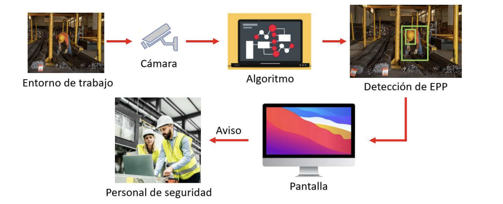
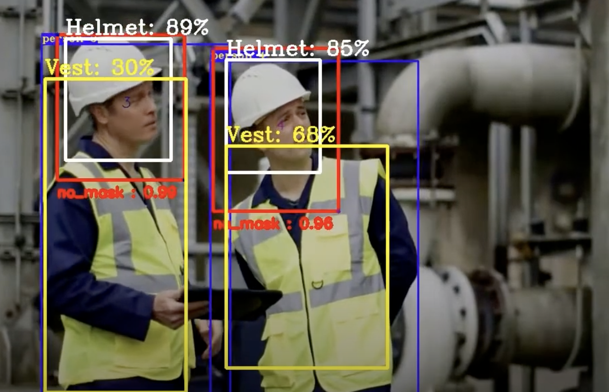
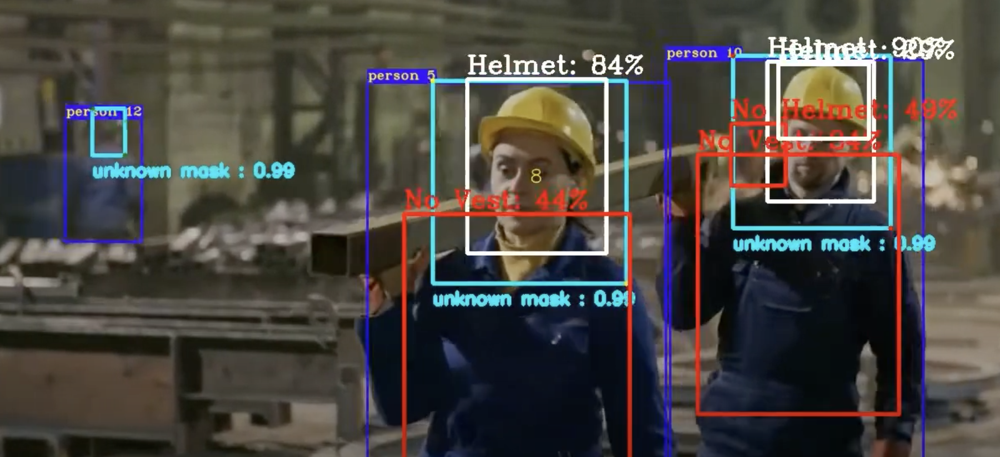

# Detección de Equipos de Protección Personal (EPP)

Este proyecto implementa un sistema de detección de Equipos de Protección Personal (EPP) utilizando visión por computadora. El sistema puede identificar diferentes elementos de protección en tiempo real a partir de imágenes o flujos de video.

## Características

- Detección de múltiples elementos de protección personal
- Procesamiento en tiempo real
- Exportación de resultados a CSV y Excel
- Interfaz de línea de comandos fácil de usar

## Requisitos

- Python 3.7 o superior
- OpenCV
- PyTorch
- NumPy
- Pandas
- Ultralytics YOLO

## Instalación

1. Clona este repositorio:
   ```bash
   git clone https://github.com/Joshue-24/Detection-of-Personal-Protective-Equipment.git
   cd Detection-of-Personal-Protective-Equipment
   ```

2. Instala las dependencias:
   ```bash
   pip install -r requirements.txt
   ```

## Uso

Para ejecutar la detección de EPP en una imagen:
```bash
python Detec.py --source imagen.jpg
```

Para usar la cámara en tiempo real:
```bash
python Detec2.py
```

## Ejemplos

### Detección de EPP en imagen


### Detección en tiempo real


### Resultados de detección


## Estructura del Proyecto

- `Detec.py`: Script principal para detección en imágenes
- `Detec2.py`: Script para detección en tiempo real con cámara
- `EPPS.pt`, `best.pt`: Modelos pre-entrenados
- `data.yaml`: Configuración de datos
- `detecciones_epps.csv` y `detecciones_epps.xlsx`: Salidas de detección
- `epps_1.png`, `epps_2.png`, `epps_3.png`: Imágenes de ejemplo

## Contribución

Las contribuciones son bienvenidas. Por favor, abre un issue primero para discutir los cambios que te gustaría hacer.


